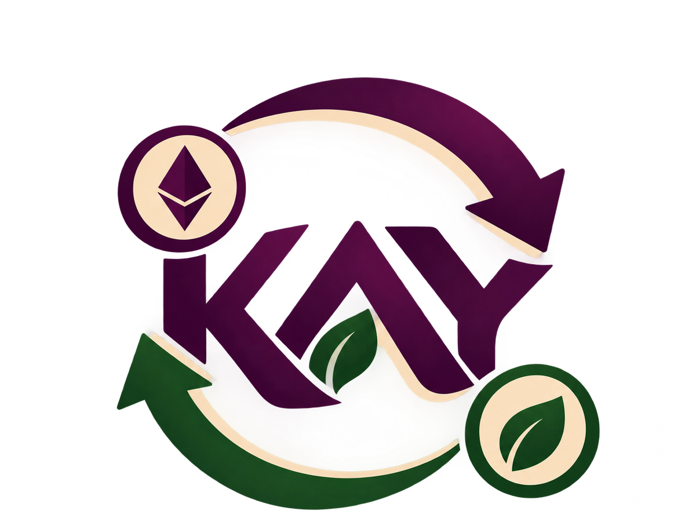

# KaySwapp | Sharp Decentralized Exchange on Sepolia

<p align="center">
  
</p>

**KaySwapp** is a Web3 Decentralized Exchange (DEX) and Automated Market Maker (AMM) application designed for swapping **Kavya Token (KAV)** with **ETH** on the Ethereum **Sepolia Testnet**.

Built with modern Web3 standards, KaySwap features constant-product liquidity pool dynamics ($x \cdot y = k$), Sign-In With Ethereum (SIWE) authentication with 15-minute auto-expiry.

---

## 📌 Deployed Sepolia Smart Contracts

The smart contracts are deployed and verified on the **Sepolia Testnet**:

| Contract Name | Symbol | Address | Etherscan Link |
| :--- | :---: | :---: | :--- |
| **KavyaToken** | `KAV` | `0x4dEb61eA0fB1b6fCDb3D03Ca95C03B6fC3c1939D` | [View on Sepolia Etherscan](https://sepolia.etherscan.io/address/0x4dEb61eA0fB1b6fCDb3D03Ca95C03B6fC3c1939D) |
| **KaySwapAMM** | `KAY-LP` | `0x98D246Ce0276024027CB40784c32cbED9B22F91a` | [View on Sepolia Etherscan](https://sepolia.etherscan.io/address/0x98D246Ce0276024027CB40784c32cbED9B22F91a) |

---

## 📊 Tokenomics & Parameters

- **Token Name**: Kavya Token
- **Token Symbol**: `KAV` (18 Decimals)
- **Max Supply Cap**: `1,000,000 KAV` (1 Million)
- **Initial Total Supply**: `500,000 KAV` (50% of Max Supply minted upon deployment)
- **Dynamic Parametrization**: Max Supply and Initial Supply are parameterized in contract deployment via Hardhat Ignition modules.
- **Testnet Faucet**: Any Sepolia wallet can request `1,000 KAV` test tokens once every 24 hours directly from the app interface.
- **Contract Owner Minting**: Contract owner can mint up to the remaining `500,000 KAV` supply limit.

---

## ⚡ Tech Stack & Architecture

### Smart Contracts (`smartcontracts/`)
- **Solidity**: `0.8.34`
- **Framework**: Hardhat 3 (`^3.17.0`)
- **Libraries**: OpenZeppelin Contracts v5 (`ERC20`, `ERC20Burnable`, `Ownable`, `ReentrancyGuard`)
- **Deployment**: Hardhat Ignition Modules (`smartcontracts/ignition/modules/KaySwapModule.ts`)
- **Testing**: Hardhat Mocha / Chai test suite (`smartcontracts/test/KaySwap.ts`)

### Frontend Application (`frontend/`)
- **Framework**: React 18 + Vite + TypeScript
- **Ethereum Provider**: Ethers.js v6 & Viem
- **Wallet Connection**: RainbowKit + Wagmi
- **Authentication**: Sign-In With Ethereum (SIWE) with per-user 15-minute session expiration
- **Icons & Styling**: Lucide React + Custom Vanilla CSS Design System

---


## 🚀 Getting Started for Developers

### Prerequisites
- Node.js `v18+` or `v20+` or `v22+`
- npm or yarn
- MetaMask or any Web3 Wallet set to **Sepolia Testnet**

---

### 1. Smart Contracts Setup

Navigate to the `smartcontracts` folder:

```bash
cd smartcontracts
npm install
```

#### Compile Smart Contracts:
```bash
npx hardhat compile
```

#### Run Unit Tests:
```bash
npx hardhat test
```

#### Deploy to Sepolia using Hardhat 3 Ignition:
```bash
npx hardhat ignition deploy ./ignition/modules/KaySwapModule.ts --network sepolia
```

---

### 2. Frontend Setup

Navigate to the `frontend` folder:

```bash
cd frontend
npm install
```

#### Run Local Development Server:
```bash
npm run dev
```

Open [http://localhost:5173](http://localhost:5173) in your browser.

#### Build Production Bundle:
```bash
npm run build
```

---

## 📁 Repository Directory Structure

```text
KaySwap/
├── README.md                      # Main Developer & User Documentation
├── smartcontracts/                # Hardhat 3 Smart Contracts Project
│   ├── contracts/
│   │   ├── KavyaToken.sol         # ERC-20 KAV Token (1M Max Supply Cap, Faucet)
│   │   └── KaySwapAMM.sol         # Constant Product AMM (KAV/ETH pair, KAY-LP)
│   ├── ignition/
│   │   └── modules/
│   │       └── KaySwapModule.ts   # Hardhat Ignition Deployment Module
│   ├── test/
│   │   └── KaySwap.ts             # Smart Contract Unit Tests (7 passing tests)
│   ├── hardhat.config.ts          # Hardhat 3 Configuration File
│   └── package.json
└── frontend/                      # React + Vite + TypeScript Application
    ├── public/
    ├── src/
    │   ├── assets/
    │   ├── components/
    │   │   ├── Header.tsx         # Logo click redirect, clean wallet display
    │   │   ├── SIWEBanner.tsx     # SIWE authentication alert box
    │   │   ├── SwapCard.tsx       # KAV <-> ETH Swap interface with slippage
    │   │   ├── LiquidityCard.tsx  # Add/Remove Liquidity desk & reserve stats
    │   │   └── TokenomicsCard.tsx # Token supply breakdown & Sepolia faucet
    │   ├── config/
    │   │   ├── contracts.ts       # Sepolia Contract Addresses & ABIs
    │   │   └── siweConfig.ts      # SIWE message generator & 15-min expiry
    │   ├── hooks/
    │   │   ├── useKaySwap.ts      # Ethers.js v6 contract interactions
    │   │   └── useSiwe.ts         # SIWE session state management
    │   ├── App.tsx                # Main App Navigation & Layout
    │   ├── main.tsx               # RainbowKit / Wagmi Sepolia Provider
    │   └── index.css              # Custom Sharp Design System
    └── package.json
```

---

## 🔐 Security & Features Highlights

1. **Constant Product AMM ($x \cdot y = k$)**: Guarantees pool liquidity with 0.3% trading fee distributed to liquidity providers.
2. **SIWE Authentication**: Prevents unauthorized actions. Sessions expire strictly after **15 minutes** of inactivity, prompting users to re-sign.
3. **1-Click Faucet**: Instant testnet onboarding allowing users to claim 1,000 KAV every 24 hours.
4. **Header Navigation**: Clicking the KaySwap logo immediately routes back to the main Swap interface.

---

## 📄 License

This project is licensed under the MIT License.
